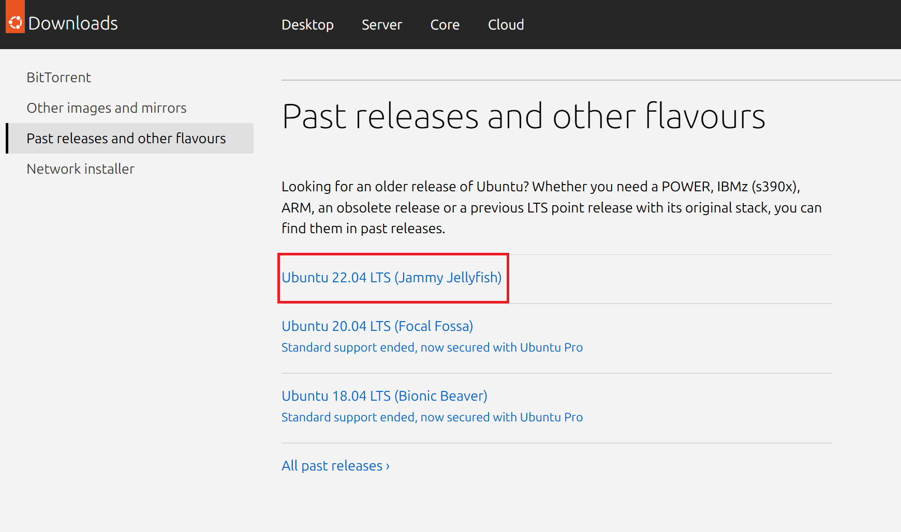
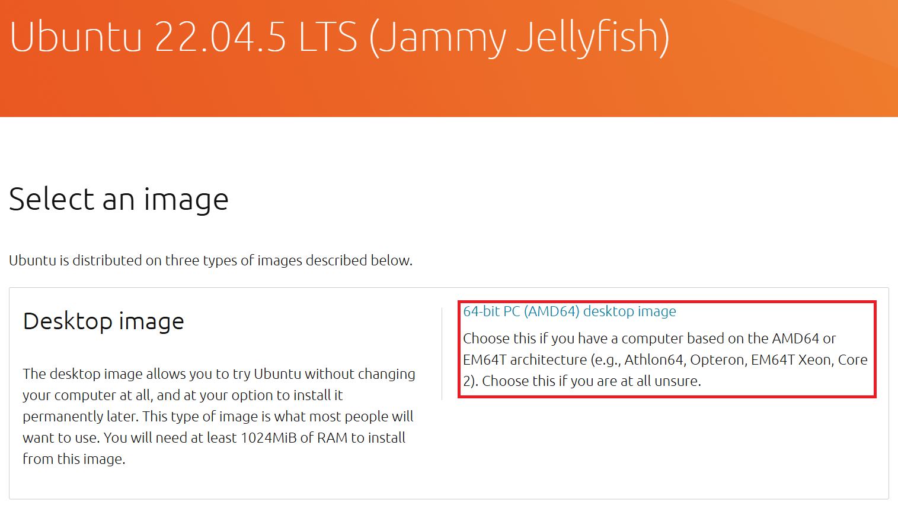
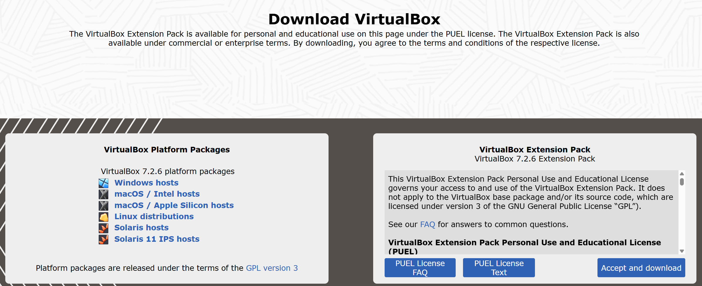

# Ubuntu22.04-ROS2-Installation-based-on-Virtual-Machine

## I. Download Ubuntu 22.04
Download Ubuntu Desktop from the official web site (https://ubuntu.com/download/desktop).

First, go to the official web site and click **'check out our alternative downloads'**.


Then, go down and click **'Ubuntu 22.04 LTS (Jammy Jellyfish)'**.



Finally, download **'64-bit PC (AMD64) desktop image'**.




## II. Download VirtualBox
### Why VirtualBox?
When using a traditional you need to install the operating system on a physical machine for evaluating software that cannot be installed on your current operating system. Oracle VirtualBox is what you need in this case, instead of reinstalling software on your physical machine. VirtualBox is designed to run virtual machines on your physical machine without reinstalling your OS that is running on a physical machine. One more VirtualBox advantage is that this product can be installed for free.

A virtual machine (VM) works much like a physical one. An OS and applications installed inside a VM “think” that they are running on a regular physical machine since emulated hardware is used for running VMs on VirtualBox. Virtual machines are isolated from each other and from the host operating system. Thus, you can perform your tests in isolated virtual machines without any concerns of damaging your host operating system or other virtual machines.

VirtualBox supports a long list of host and guest operating systems. A host OS is the operating system installed on a physical machine, on which VirtualBox is installed. A guest OS is an operating system installed on a virtual machine running inside VirtualBox. VirtualBox can be installed on Windows, Linux, macOS, Solaris, and FreeBSD. On VirtualBox you can run VMs with Windows, Linux, macOS, Solaris, FreeBSD, Novell Netware, and other operating systems.

Go to the official web site (Link: https://www.virtualbox.org/wiki/Downloads) to download the VirtualBox installer for your operating system. See in the figure below:



### Run the installer and define the installation options

1. Run the VirtualBox installer. The installation wizard that has a GUI (graphical user interface) should appear.
   
2. Select the manner in which you want features to be installed, clicking on the installation directory and installed components—you can leave the default values. Then tick the checkboxes near shortcut options and file associations.

3. Confirm installation of VirtualBox network interfaces (click Yes).

4. On the Ready to Install Screen, hit Install to start the installation process.

5. After finishing installation, you can tick the checkbox for starting VirtualBox after installation.

### Deploying a New VM
Once you have installed VirtualBox, open the application. You can see the graphical user interface of VirtualBox which is unified for all supported host operating systems. You can also use the command line interface and VBoxManage if needed. In the current example VirtualBox is set up on Windows.

### Creating a Virtual Machine
Click **Machine** > **New** or hit the icon with the blue star to create a new virtual machine in VirtualBox GUI.


Specify name, Machine Folder (to save),Type and version for your virtual machine  and click on **Next**.


Here, we have to choose the base memory based on your host system RAM size. It is highly recommended to not choose less than 1GB (if possibly choose more than _25GB_).specify RAM _2048_ (better _6GB_ = _6144MB_ ) and click on **Next**.


> [!NOTE]
> Ubuntu recommends at least 25GB of free storage for smooth running.

Click on **settings** to see the system information of your virtual machine.


Load Ubuntu ISO Image file to your virtual machine:

Go to storage section and click on Empty then load your ubuntu 20.04 iso image from your local machine as shown below.


select **ubuntu 20.04 iso image** and click on **open**.


The Ubuntu 20.4 iso image has been loaded successfully to your virtual machine and click on **ok**.


Install Ubuntu 20.04.1 LTS in Virtual Machine: Click on Start to start the installing ubuntu.


> [!TIP]
> Full screen: Devices ->Insert Guest Additions CD image. And reboot Virtual System.

## III. Install ROS2

See https://docs.ros.org/en/humble/Installation/Ubuntu-Install-Debs.html.

3.1 Environment setup

You must source this script in every **bash** terminal you use ROS in.
```
source /opt/ros/humble/setup.bash
```
It can be convenient to automatically source this script every time a new shell is launched. These commands will do that for you.

**Bash**
> [!CAUTION]
> If you have more than one ROS distribution installed, ~/.bashrc must only source the setup.bash for the version you are currently using.

```
echo "source /opt/ros/humble/setup.bash" >> ~/.bashrc
source ~/.bashrc
```

3.5 Dependencies for building packages

Up to now you have installed what you need to run the core ROS packages. To create and manage your own ROS workspaces, there are various tools and requirements that are distributed separately. For example, rosinstall is a frequently used command-line tool that enables you to easily download many source trees for ROS packages with one command.

To install this tool and other dependencies for building ROS packages, run:
```
sudo apt install python3-rosdep python3-rosinstall python3-rosinstall-generator python3-wstool build-essential
```

Before you can use many ROS tools, you will need to initialize rosdep. rosdep enables you to easily install system dependencies for source you want to compile and is required to run some core components in ROS. If you have not yet installed **rosdep**, do so as follows.
```
sudo apt install python3-rosdep2
```

With the following, you can initialize rosdep.
```
sudo rosdep init
rosdep update
```
<!--
## IV. Create a ROS Workspace
Let's create and build a catkin workspace:
```
mkdir -p ~/catkin_ws/src
cd ~/catkin_ws/src
catkin_init_workspace
cd ~/catkin_ws
catkin_make
source devel/setup.bash
```
-->
## IV. Install gazebo_ros_pkgs
The gazebo_ros_pkgs packages are available in:

Install Gazebo Fortress dependencies:
```
sudo apt-get install ignition-fortress libignition-cmake2-dev ros-humble-ros-gz
```
In stall pip and git:
```
sudo apt install python3-pip
sudo apt install git
```
Install xmacro (xml macro tool for sdf):
```
pip install xmacro
```
Clone all the packages in **/catkin_ws/src**:
```
mkdir -p ~/catkin_ws/src
cd ~/catkin_ws/src
git clone https://github.com/robomaster-oss/rmoss_interfaces -b humble
git clone https://github.com/robomaster-oss/rmoss_core -b humble
git clone https://github.com/robomaster-oss/rmoss_gazebo -b humble
git clone https://github.com/robomaster-oss/rmoss_gz_resources -b humble --depth=1
git clone https://github.com/robomaster-oss/rmua19_gazebo_simulator -b humble
```
Change directory to **/catkin_ws** and Use rosdep to automatically install the system dependencies required for a ROS 2 project.:
```
cd ..
rosdep install -y -r -q --from-paths src --ignore-src --rosdistro humble
```
Install colcon:
```
sudo apt install python3-colcon-common-extension
```
And then, build the work space:
```
colcon build
```
You can test the gazebo by run:
```
gazebo.gz gazebo
```


```
sudo snap install gazebo --channel=citadel/beta
```
You can then test it with
```
gazebo.gz gazebo shapes.sdf 
```


<!--
Make sure that **XDG_SESSION_TYPE** is Xorg:
```
echo $XDG_SESSION_TYPE
```
if the response is 
```
x11
```
The system is in Xorg. 

If the response is:
```
wayland
```
Run 
```
sudo gedit /etc/gdm3/custom.conf
```
And change **#WaylandEnable=false** to **WaylandEnable=false**.
-->

### Setup A TurtleBot3 Simulation Workspace
#### Install TurtleBot3:
```
sudo apt install ros-humble-turtlebot3*
```

#### Install Dependent ROS 2 Packages:

Install Cartographer
```
sudo apt install ros-humble-cartographer
sudo apt install ros-humble-cartographer-ros
```

Install Navigation2
```
sudo apt install ros-humble-navigation2
sudo apt install ros-humble-nav2-bringup
```

#### Install the required TurtleBot3 Packages.

These instructions require the use of the catkin build system.

If you do not have a catkin workspace setup, try the following commands:
```
mkdir -p ~/catkin_ws/src
cd ~/catkin_ws/src
git clone -b humble https://github.com/ROBOTIS-GIT/DynamixelSDK.git
git clone -b humble https://github.com/ROBOTIS-GIT/turtlebot3_msgs.git
git clone -b humble https://github.com/ROBOTIS-GIT/turtlebot3.git
sudo apt install python3-colcon-common-extensions
cd ~/catkin_ws
colcon build --symlink-install
```
Then add to your **.bashrc** file a source to the setup scripts:
```
echo "source ~/catkin_ws/devel/setup.bash" >> ~/.bashrc
source ~/.bashrc
```

#### Launch Simulation World
Three simulation environments are prepared for TurtleBot3. Please select one of these environments to launch Gazebo.

1. Empty World
```
export TURTLEBOT3_MODEL=burger
ros2 launch turtlebot3_gazebo empty_world.launch.py
```

2. TurtleBot3 World
```
export TURTLEBOT3_MODEL=waffle
ros2 launch turtlebot3_gazebo turtlebot3_world.launch.py
```

3. TurtleBot3 House
```
export TURTLEBOT3_MODEL=waffle_pi
ros2 launch turtlebot3_gazebo turtlebot3_house.launch.py
```


## VI. Install Gazabo_robotino
Install gazebo on your computer :
```
sudo apt install ros-noetic-gazebo-ros ros-noetic-gazebo-plugins gazebo11 
```

Make sure git is installed on your Ubuntu machine:
```
sudo apt-get install git
```

Open a new terminal :
```
cd ~
git clone https://github.com/cyiwen316/Gazebo_UPHF.git
echo 'export GAZEBO_MODEL_PATH=$GAZEBO_MODEL_PATH:$HOME/Gazebo_UPHF/models' >> ~/.bashrc
source ~/.bashrc
```

```
cd ~/catkin_ws/src
git clone https://github.com/cyiwen316/gazebo_robotino_ros_pkg.git
cd ~/catkin_ws
catkin_make
```

```
echo "source ~/catkin_ws/devel/setup.bash" >> ~/.bashrc
source ~/.bashrc
```

How to use the simulator

To launch the simulator :

Open a terminal :
```
roslaunch gazebo_robotino_ros_pkg env_global.launch
```
You can launch the 3D frontend of gazebo by launching in a another terminal :
```
gzclient
```

There is a top camera on the simulation to see the robot and the terrain, you can see it by using rqt_image_view and looking the topic /gazebo/camera/top_camera/image_raw. You can run it in a new terminal :
```
rqt_image_view /gazebo/camera/top_camera/image_raw
```


> [!NOTE]
> Useful information that users should know, even when skimming content.

> [!TIP]
> Helpful advice for doing things better or more easily.

> [!IMPORTANT]
> Key information users need to know to achieve their goal.

> [!WARNING]
> Urgent info that needs immediate user attention to avoid problems.

> [!CAUTION]
> Advises about risks or negative outcomes of certain actions.


